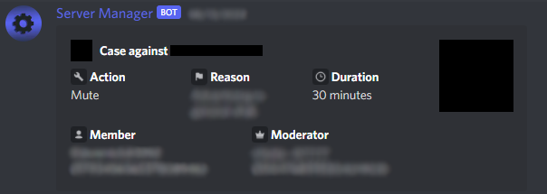
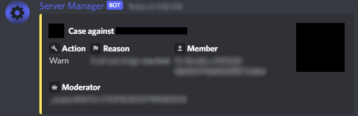

import Button from '../../src/components/Button';
import {
  DiscordInteraction,
  DiscordMessage,
  DiscordMessages,
  DiscordEmbed,
  DiscordEmbedField,
  DiscordEmbedFields,
} from "discord-message-components/packages/react";
import "discord-message-components/packages/react/dist/style.css";

⚠ To use any of these commands, you need to have <strong>Manage Guild</strong> permissions or be in one or more of the <code>admin_roles</code> config roles set by the server.

## Administrator Roles

🛑 Anyone with <strong>Manage Guild</strong> permissions or higher automatically by-pass this check.

| Usage | Description | Premium |
| ----------- | ----------- | ----------- |
| /config admin_roles [hidden] | View the server's admin roles | False |
| /config admin_role add &lt;role&gt| Add a role to the admin roles | False |
| /config admin_role remove &lt;role&gt| Remove a role from the admin roles | False |

## Moderator Roles

Anyone in the <code>admin_roles</code> role(s) configuration automatically by-pass this check.

| Usage | Description | Premium |
| ----------- | ----------- | ----------- |
| /config moderator_roles [hidden] | View the server's moderator roles | False |
| /config moderator_role add &lt;role&gt | Add a role to the moderator roles | False |
| /config moderator_role remove &lt;role&gt | Remove a role from the moderator roles | False |

## Moderation Configurations

| Usage | Description | Premium |
| ----------- | ----------- | ----------- |
| /config appeal_server_invite &lt;invite&gt | Set the server's [appeal server invite](../updates/appeal-server-invite-notice.md) | <premium>True</premium> |

## Suggestion Configurations

| Usage | Description | Premium |
| ----------- | ----------- | ----------- |
| /config suggestions_channel &lt;#channel&gt; | Set the servers suggestion channel | False |
| /config discussion_threads &lt;value&gt; | Set the whether a thread should be created on suggestion creation | False |
| /config suggestion_ping &lt;@role&gt; | Set a role to be pinged when a suggestion is submitted - `None` by default | False |

## Custom Reasons

| Usage | Description | Premium |
| ----------- | ----------- | ----------- |
| /config custom_reasons [hidden] | View the server's custom reasons | False |
| /config custom_reason add &lt;name&gt &lt;value&gt | Add a custom reason - `name` will show up in slash command auto-complete for moderation commands and then will use `value` for the reason | False |

## Logging

  
Preview

  <h3>Mutes</h3>

  
  <h3>Warnings</h3>

  

 

| Usage | Description | Premium |
| ----------- | ----------- | ----------- |
| /config log_channel &lt;#channel&gt | Set the server's log channel | False |

The log channel is only used for moderation logs at the moment

